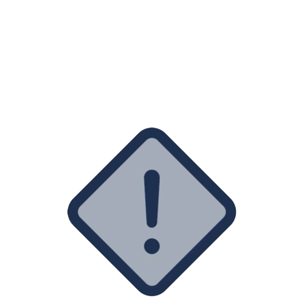

##  SOC & SIEM Projects

**[Live SOC Monitoring & Incident Response Lab ](https://github.com/justinemanuelj/Live-SOC-Monitoring-Incident-Response-Lab)**  
 

Simulated a live SOC environment by monitoring real-time alerts, triaging incidents, and escalating confirmed threats. Practiced end-to-end incident response from detection to resolution.

---

**[SIEM Deployment & Detection Engineering (IBM QRadar) ](https://github.com/justinemanuelj/SIEM-Deployment-Detection-Engineering-IBM-QRadar-)**  

Deployed and configured IBM QRadar in a simulated enterprise environment. Built log ingestion pipelines, created custom correlation rules, and tuned detections to reduce false positives.

---

**[Splunk SIEM Implementation & Dashboard Development ](https://github.com/justinemanuelj/Splunk-SIEM-Implementation-Dashboard-Development)**  

Implemented a Splunk SIEM environment and developed dashboards to visualize security events. Wrote SPL queries and built alerts for real-time monitoring.

---

**[Wazuh Deployment & Threat Detection Lab ](https://github.com/justinemanuelj/Wazuh-Deployment-Threat-Detection-Lab)**  

Deployed Wazuh for host-based intrusion detection and centralized logging. Configured agents, monitored file integrity, and analyzed alerts across endpoints.

---

**[SOAR Automation & Incident Response Workflow (TheHive) ](https://github.com/justinemanuelj/SOAR-Automation-Incident-Response-Workflow-TheHive-)**  

Built and executed incident response workflows using TheHive. Automated case management and response actions for faster incident handling.

---

##  Certifications

**[CompTIA ITF+](https://placeholder-url.com)**  
**[CompTIA A+](https://placeholder-url.com)**  
**[CompTIA Network+](https://placeholder-url.com)**  
**[CompTIA Security+](https://placeholder-url.com)**  

---

##  Skills & Technologies

- **SOC Operations & Monitoring**  
- **Incident Response Lifecycle**  
- **SIEM Deployment & Administration**  
- **IBM QRadar**  
- **Splunk (SPL, Dashboards, Alerting)**  
- **Wazuh (HIDS, FIM, Endpoint Monitoring)**  
- **SOAR & TheHive Case Management**  
- **Log Ingestion & Normalization**  
- **Correlation Rule Development**  
- **Threat Detection & Analysis**  
- **Alert Triage & Escalation**  
- **Security Event Monitoring**  

---

##  Connect With Me

